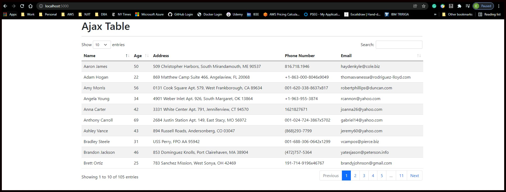

# Beautiful Tables Assigment 

## By Edgardo Guillen

## IS 601

## Basic Table
### We start with 5 user in this table

## Ajax Table
### Note: Added 100 users to have 105 records in this table

## Server Table
### Note: Added 1000 fake users to have 1105 records in this table

## Conclusion
### The dataTables.js library has an extensive list of features ready to use when creating tables in flask.

## Commit History
